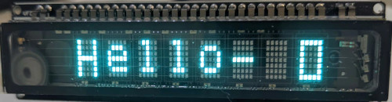

# 8MD06INKM-for-micropython
## instruction
  
this is drive for the 8MD06INKM, a kind of vfd dispaly. MCU is `raspbarry pi pico`.  
place be attention, 8MD06INKM is LSB first!!!  
more command and character encoding see [[this](/doc/8MD06INKM_A.pdf)]
## usage
``` python
from machine import SPI, Pin
from _8MD06INKM import _8MD06INKM
import time

rest_pin=Pin(27, Pin.OUT)
cs_pin=Pin(28, Pin.OUT)
hv_en_pin=Pin(29, Pin.OUT)

spi=SPI(id=1, baudrate=100_000, polarity=1, phase=1, sck=Pin(10, Pin.OUT), mosi=Pin(11,Pin.OUT))

display = _8MD06INKM(spi, rest_pin, cs_pin, hv_en_pin)
display.init()

display.set_brightness(100)
time.sleep(1)
display.set_brightness(255)

display.hv_off()
time.sleep(1)
display.hv_on()


display.print_code(0,0x0a)
display.print_char(1,'h')
display.print_char(2,'e')
display.print_char(3,'l')
display.print_char(4,'l')
display.print_char(5,'o')
display.print_char(6,'!')
display.print_code(7,0x0b)
```